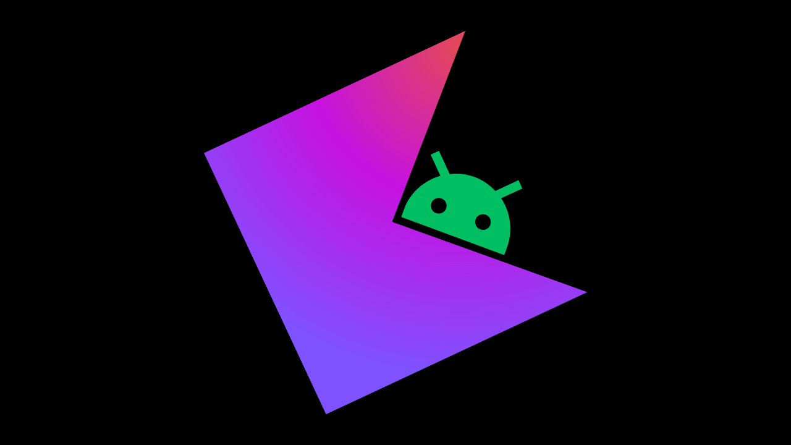

## Kotlin Basics Course

This course is designed to be your first step into programming. Kotlin is a modern and beautiful language to learn. After completing this course, you will be able to write your own console programs and have a solid foundation for tackling intermediate to advanced programming topics.

## Who should take this course?

If you are primarily

- new to programming
- Willing to dive into Android development specifically.

And you're most welcome if you're already a developer and:

-  want to recap your knowledge in Kotlin
-  want to upgrade from Java to Kotlin

## How to take this Course?

This course is project based course, Where Theory is explained in video, following by couple of assignments that you should solve after each lesson, each lesson will have 3 to 4 tasks, you can keep track of your progress using the Course in IntelliJ Idea IDE.

To keep you motivated, there are three small console projects recommended for you to build. It is advised to complete all of them and follow the project assignments after each theory lesson.

### Lessons

- Theory
-  Writing code
-  Explaining tasks
-  How today's lesson could help solve the project tasks

### Tasks

For each lesson, tasks are ordered from easy to hard.

### Projects

Projects will be in separate repository to allow flexibility in choosing and adding more projects to the course in the future.

#### Palestine chat bot

You will create a chatbot to teach facts about Palestine and the Palestinian resistance. The chatbot will then ask you questions about the revised facts.

#### Password Generator

In this app, we will create a simple tool to generate strong passwords. Users can specify the following:
-  Password length
-  Use of numbers
-  Use of special characters
   The app will display the password strength based on certain criteria.

#### Contacts Book

In this project, we will create a Contacts app that can read from and write to a file on your computer. The app will have several features, including adding, removing, updating, searching, and sorting contacts.

## Tools and Environment

- [IntelliJ idea Community edition](https://www.jetbrains.com/idea/download/)
- [JetBrains Academy plugin](https://plugins.jetbrains.com/plugin/10081-jetbrains-academy)
- Lessons and Tasks Repository (*This one*)
- Projects Repository

## Support

We have a couple of support channels. The main one is the Discord community, where you can discuss and seek help. Additionally, please comment on videos to request tasks solutions or building projects.

- Discord: https://discord.gg/GwpSEAQdck
- Youtube: https://youtube.com/@mibrahimdev
